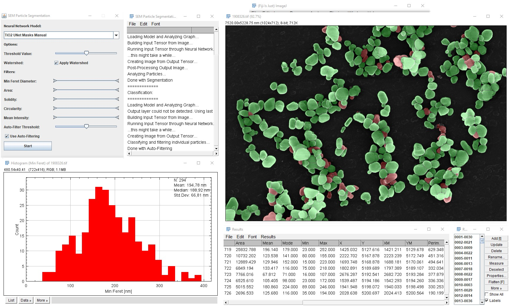

ImageJ Plugin for Automatic SEM Image Segmentation
==================================================
The files in this repository accompany the following publication:

[B. Ruehle, J. F. Krumrey, V.-D. Hodoroaba, Scientific Reports, _Workflow towards Automated Segmentation of Agglomerated, Non-Spherical Particles from Electron Microscopy Images using Artificial Neural Networks_, **2020**, DOI: 10.1038/s41598-021-84287-6](https://doi.org/10.1038/s41598-021-84287-6)

If you use the files or code in your own work, please cite the above article.

Unless stated otherwise, all files on this page are provided under the [MIT license](https://opensource.org/licenses/MIT).

The Plug-In was stable and performed as expected in our hands, but was not tested extensively, that is why it is still labeled as "beta".



Installation
----------------
The plugin and installation instructions were tested on the 64 bit FIJI distribution of ImageJ, available [here](https://imagej.net/Fiji/Downloads).
  1. Install Tensoflow for ImageJ (*ImageJ* -> *Help* -> *Update…* -> *Manage Update Sites*) and close ImageJ (do not restart yet).
  
  2. Copy the plugin (`SEM_Particle_Segmentation.jar`) and the entire folder (not the individual files) containing the trained neural networks (`SEM_Particle_Segmentation_Models`) into the `plugins` directory of ImageJ (e.g., `C:\user\<user>\Fiji.app\plugins`).
  3. Restart ImageJ, make sure the tensorflow version is set to `1.12.0 CPU` (*Edit* -> *Options* -> *TensorFlow...*), update ImageJ to the latest version (*Help* -> *Update ImageJ*) and restart again (probably a bug, but sometimes changing the tensorflow version had no effect (it was always back to 1.12.0 after restart), and also some other functionality seemed to be lost when updating to TensorFlow, which could be restored by updating ImageJ after installing tensorflow). The plugin can be found under *Plugins* -> *SEM Particle Segmentation*.
  

How to use:
-----------
  * The plugin has a simple GUI that allows to choose the appropriate neural network for the segmentation from the list on top, and then run it by clicking “Start”. The sliders can be used to further filter the results interactively after segmentation, or filtering can be done automatically by a second classifier network.
  * Besides a log file, a histogram, and overlays on the original input image, 2 more images are created that contain the raw output from the neural network (a 32-bit image in which each pixel assumes values between [0, 1], which can be interpreted as the probabilities the network predicted for this pixel to be part of a particle or belonging to the background) and the segmentation mask that is obtained by applying a threshold to the raw output (the value is determined by the “Threshold Slider”), followed by a watershed segmentation (if the checkbox “Apply Watershed” is selected). If "Auto-Filtering" is selected as well, a third image with the classification results is also created. Here, each pixel value can be interpreted as the probability predicted by the classifier that a pixel belongs to a particle that should be kept in the final particle size statistics.
  * The user can add their own models by simply copying them into the `Plugins\SEM_Particle_Segmentation_Models` folder (the Plugin scans this folder at startup and fills the list of available models automatically). However, at the time of release, ImageJ used Tensorflow 1.12, so newer tensorflow 2.x/keras models have to be converted to tensorflow 1.12.0 protobuf files before they can be used with ImageJ (see next section for details).
  * **IMPORTANT**: If you used contrast optimization for removing hot/cold pixels before training the UNet (which is the default in version 1.1 of the workflow), you might want to preprocess your images in ImageJ as well in a similar way by selecting **Process** -> **Adjust Contrast...**, and then entering a similar value as was used during training (e.g., if the contrast optimization range was set to (1, 99) in StartProcess.py, you might want to try setting the value in ImageJ to 2%).
  * Technical Note: The classification model provided here works slightly differently from the one used in the publication, it uses four classes for classifying particles and calculates a weighted average of the class scores, while the one in the publication uses only 2 classes.

Converting tensorflow 2.x/keras models to tensorflow 1.12.0 protobuf files
--------------------------------------------------------------------------
In the past, we used a slightly modified version of the python script by Amir H. Abdi published under the MIT license on [GitHub](https://github.com/amir-abdi/keras_to_tensorflow) for this purpose. The process has now been simplified and streamlined towards UNet models trained with the workflow. A script for saving the model weights as well as parts of its configuration from a pretrained UNet model, as well as a second script for re-building the same model in tensorflow 1.12.0, loading the previously saved weights, and saving the model as a tensorflow 1.12.0 pb file were added to the `Convert_Models_to_TF112` directory.

General procedure:
  1. Load the trained model from the **same** python environment/venv that you used for training the model, and save the model weights using the `model.save_weights()` function. You can do this by simply running the `save_model_weights.py` script with the model path as a command-line-argument. For models saved in the old h5 format, use:
	 ```
     python save_model_weights.py -model_input_path=".\Model.h5"
	 ```
	 For models saved in the new format, give the path to the folder containing the model.pb and keras_metadata.pb files and the variables and assets dirctories:
	 ```
	 python save_model_weights.py -model_input_path=".\Model"
	 ```
	 This will create two new files in the same directory, called Model_weights.h5 and Model.config.  
  2. Set up a new virtual environment that can run tensorflow 1.12.0. This rerquires python 3.6 and older versions of some dependencies. If you want to use the environment simply for creating the model, it is not necessary to bother setting up GPU support.  
		 a. Download and install [python 3.6.8](https://www.python.org/downloads/release/python-368/).  
		 b. Create a new virtual environment with this python version (specify the path to the python 3.6 executable for running venv as shown below, or use the `virtualenvironment` package with the `--python==3.6` option)  
		 c. Activate the newly created virtual environment  
		 d. Update pip and install the required packages  
		 e. Run the script for saving the model as a tensorflow 1.12.0 pb file  
	 ```
	 %APPDATA%\..\Local\Programs\Python\Python36\python.exe -m venv .\venv_tf_112
	 .\venv_tf_112\Scripts\activate
	 python -m pip install --upgrade pip
	 pip install tensorflow==1.12
	 pip install protobuf==3.11.0
	 pip install h5py==2.10.0
	 pip install keras==2.2.4
	 python create_tf112_pb_model_from_hdf5_weights.py -weights_path="./Model_weights.h5"
	 ```
	 This will create a `Model.pb` file in the same directory. In the future, you can of course reuse the virtual environment and skip steps a, b, and d. If you have already saved your model weights manually and do not have a Model.config file you can also provide the necessary parameters via command-line arguments:
	 ```
	 python create_tf112_pb_model_from_hdf5_weights.py -weights_path="./Model_weights.h5" --input_shape="(384,384,1)" --output_channels=1 --filters=16
	 ```  
  3. Copy the `Model.pb` file that was created into `Plugins\SEM_Particle_Segmentation_Models` folder of ImageJ.  
