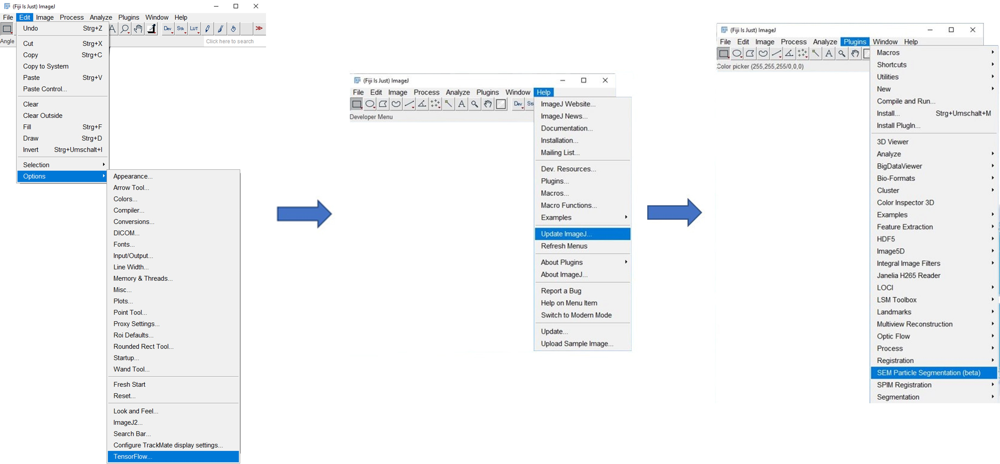

ImageJ Plugin for Automatic SEM Image Segmentation
==================================================
The files in this repository accompany the following publication:

[B. Ruehle, J. F. Krumrey, V.-D. Hodoroaba, Scientific Reports, _Workflow towards Automated Segmentation of Agglomerated, Non-Spherical Particles from Electron Microscopy Images using Artificial Neural Networks_, **2020**, DOI: 10.1038/s41598-021-84287-6](https://doi.org/10.1038/s41598-021-84287-6)

If you use the files or code in your own work, please cite the above article.

Unless stated otherwise, all files on this page are provided under the [MIT license](https://opensource.org/licenses/MIT).

The Plug-In was stable and performed as expected in our hands, but was not tested extensively, that is why it is still labeled as "beta".

Installation
----------------
The plugin and installation instructions were tested on the 64 bit FIJI distribution of ImageJ, available [here](https://imagej.net/Fiji/Downloads).
  1. Install Tensoflow for ImageJ (*ImageJ* -> *Help* -> *Update…* -> *Manage Update Sites*) and close ImageJ (do not restart yet).
  
  2. Copy the plugin (`SEM_Particle_Segmentation.jar`) and the entire folder (not the individual files) containing the trained neural networks (`SEM_Particle_Segmentation_Models`) into the `plugins` directory of ImageJ (e.g., `C:\user\<user>\Fiji.app\plugins`).
  3. Restart ImageJ, update it to the latest version (*Help* -> *Update ImageJ*) and restart again (probably a bug, some functionality seems to be lost when updating to TensorFlow, which can be restored that way). The plugin can be found under *Plugins* -> *SEM Particle Segmentation*.
  

How to use:
-----------
  * The plugin has a simple GUI that allows to choose the appropriate neural network for the segmentation from the list on top, and then run it by clicking “Start”. The sliders can be used to further filter the results interactively after segmentation, or filtering can be done automatically by a second classifier network.
  * Besides a log file, a histogram, and overlays on the original input image, 2 more images are created that contain the raw output from the neural network (a 32-bit image in which each pixel assumes values between [0, 1], which can be interpreted as the probabilities the network predicted for this pixel to be part of a particle or belonging to the background) and the segmentation mask that is obtained by applying a threshold to the raw output (the value is determined by the “Threshold Slider”), followed by a watershed segmentation (if the checkbox “Apply Watershed” is selected). If "Auto-Filtering" is selected as well, a third image with the classification results is also created. Here, each pixel value can be interpreted as the probability predicted by the classifier that a pixel belongs to a particle that should be kept in the final particle size statistics.
  * The user can add their own models by simply copying them into the `Plugins\SEM_Particle_Segmentation_Models` folder (the Plugin scans this folder at startup and fills the list of available models automatically). However, at the time of release, ImageJ used Tensorflow 1.12, so Keras models have to be converted from hdf5 to protobuf files. We used a slightly modified version of the python script by Amir H. Abdi published under the MIT license on [GitHub](https://github.com/amir-abdi/keras_to_tensorflow) for this purpose. For models created in Tensorflow 1.x, the hdf5 files could be loaded and converted directly, for models created in Tensorflow 2.x, this sometimes failed. In these cases, saving the weights instead of the model using `model.save_weights` after training in Tensorflow 2.x, building the same model in Keras 1.x, and then loading the previously saved weights into the Keras 1.x model worked.
  * Technical Note: The classification model provided here works slightly differently from the one used in the publication, it uses four classes for classifying particles and calculates a weighted average of the class scores, while the one in the publication uses only 2 classes.
