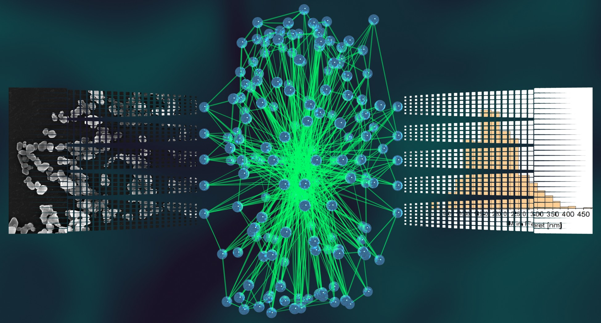

Automatic SEM Image Segmentation
================================
The files and images in this repository accompany the following publication:

[B. Ruehle, J. F. Krumrey, V.-D. Hodoroaba, Scientific Reports, _Workflow towards Automated Segmentation of Agglomerated, Non-Spherical Particles from Electron Microscopy Images using Artificial Neural Networks_, **2020**, DOI: 10.1038/s41598-021-84287-6](https://doi.org/10.1038/s41598-021-84287-6)

If you use the files, data, or code in your own work, please cite the above article.



Folder Structure:
-----------------
  * **Archive:** Contains the files discussed and used in the original [publication](https://doi.org/10.1038/s41598-021-84287-6).
    - **Automatic_SEM_Image_Segmentation:** Contains the version of the Python code that was used in the original publication.
	- **Other Scripts:** Contains scripts for calculating the various metrics discussed in the publication.
	- **Trained Neural Network Models:** Contains the fully trained neural networks for SEM image segmentation trained on simulated and manually annotated masks as well as the fully trained classification network trained on manually annotated classes for the masks, as discussed in the publication.
  * **Automatic_SEM_Image_Segmentation:** Contains the most current implementation of the workflow, including improvements, new features, updates, bug fixes, etc.
  * **Datasets:** Contains the datasets used in the publication. The dataset is also available via [Zenodo](https://zenodo.org/record/4563942) (DOI: 10.5281/zenodo.4563942). It has the following subfolders:
    - **Electron Microscopy Image Masks:** Contains the manually annotated segmentation and classification masks for the SEM images.
    - **Electron Microscopy Images:** Contains the raw, unprocessed SEM and TSEM images used in the publication
  * **ImageJ Plugin:** Contains an ImageJ Plugin (beta version) that allows to use the fully trained neural networks in inference mode as well as some basic filters directly from ImageJ
  * **Other Scripts:** Contains example files (python and jupyter notebook) demonstrating how to use the trained models for segmenting and classifying SEM images

How to use:
-----------
  1. To try the fully automated segmentation with standard parameters, download the python scripts from the folder `Automatic SEM Image Segmentation` and place them in a new directory.
  2. Create the following sub directories:
     * `Input_Images`
     * `Input_Masks`
  3. Place the SEM images in the `Input_Images` folder and some exemplary particle outlines (64 pixel x 64 pixel) in the `Input_Masks` directory.
  4. Start the process by running `python startProcess.py`
  
Dependencies:
-------------
You can install all dependencies of the required version by running
```
pip install -r requirements.txt
```
or install the following packages manually (for some packages the exact version number might not be too important, but for others, changes were introduced in later versions that are not backwards compatible and will break the code):
numpy==1.18.5
tensorflow==2.2.0
tensorflow_addons==0.11.2
imageio==2.5.0
scikit-image==0.15.0
Pillow==8.2.0
scipy==1.4.1
opencv-python==4.5.2.54
matplotlib==3.5.2
tqdm==4.62.3
opensimplex==0.3

Examples:
---------
The following images illustrate a few examples of particles consisiting of different materials (Au, TiO2, BaSO4, SiO2, FeOx) and imaged with different techniques (SEM, eSEM, TEM), and their segmentation masks that were obtained automatically using the above algorithm (or slight variations thereof).


Licenses:
---------
The files of this project are provided under diffrerent licenses, please refer also to the [license file](./LICENSE) in the root directory for details. In short, the following licenses are used:  
  * The scientific publication itself is published under the Creative Commons Attribution 4.0 International license [CC BY 4.0](https://creativecommons.org/licenses/by/4.0/legalcode), and was first published in [Scientific Reports](https://doi.org/10.1038/s41598-021-84287-6).  
  * The Python implementation of the workflow is published under the [GNU General Public License v3.0](https://www.gnu.org/licenses/gpl-3.0-standalone.html).  
  * The ImageJ Plugin is published under the [MIT license](https://opensource.org/licenses/MIT).  
  * The training and validation data and the derived images and masks are published under the Creative Commons Attribution-NonCommercial-NoDerivatives 4.0 International license ([CC BY-NC-ND 4.0](https://creativecommons.org/licenses/by-nc-nd/4.0/legalcode)).  

Parts of the code used in this project are based on code published under the following licenses:  
  * The WGAN implementation used in this project is based on the work by A. K. Nain published on the [Keras website](https://keras.io/examples/generative/wgan_gp/) under the [Apache License v2.0](https://www.apache.org/licenses/LICENSE-2.0.txt).  
  * The cycleGAN implementation used in this project is based on the work by S. T. Karlson published on [GitHub](https://github.com/simontomaskarlsson/CycleGAN-Keras) under the [GNU General Public License v3.0](https://www.gnu.org/licenses/gpl-3.0-standalone.html).  
  * The MultiRes UNet implementation used in this project is based on the work by N. Ibtehaz published on [GitHub](https://github.com/nibtehaz/MultiResUNet) under the [MIT license](https://opensource.org/licenses/MIT).  
